# Liver_damage_prediction
This project focuses on predicting the stage of liver damage (Cirrhosis) using machine learning techniques. The dataset was analyzed, preprocessed, and used to build supervised logistic regression model and a sequential neural network deep learning model that can identify different stages of liver damage. 
__________________________________________________________________________________________________________________________________________________________________

__
**Dataset**

* Source:Kaggle

* Number of samples: 418

* Number of features: 20

* Target variable: stage

**Data Preprocessing**

* Handling missing values:
    * Rows with excessive missing values were dropped during the data cleaning phase to ensure better data quality and model performance.
* Encoding categorical variables
    * Using column transformer. 
* Feature scaling
* Handle imbalanced classes
    * SMOTE.
* Feature selection
    * Wrapper method.
------------------------------------------------------------------------------------------------------------------------------------------------------------------
## **Exploratory Visualizations**

  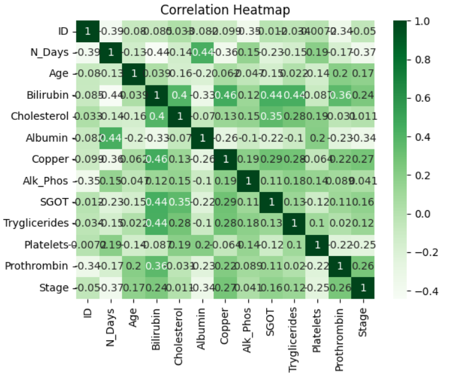
  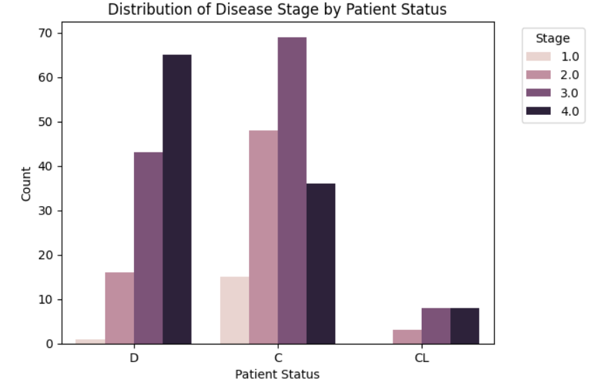
  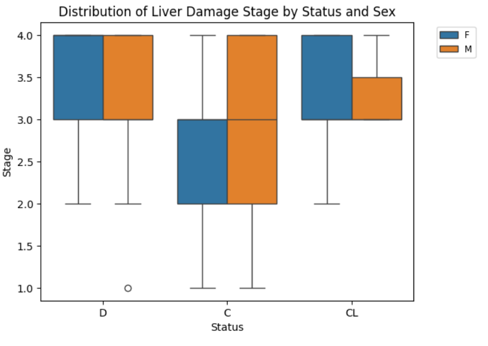

------------------------------------------------------------------------------------------------------------------------------------------------------------------
## **Multiclassification Supervised Machine learning**
**logistic Regression**

## **default model**

  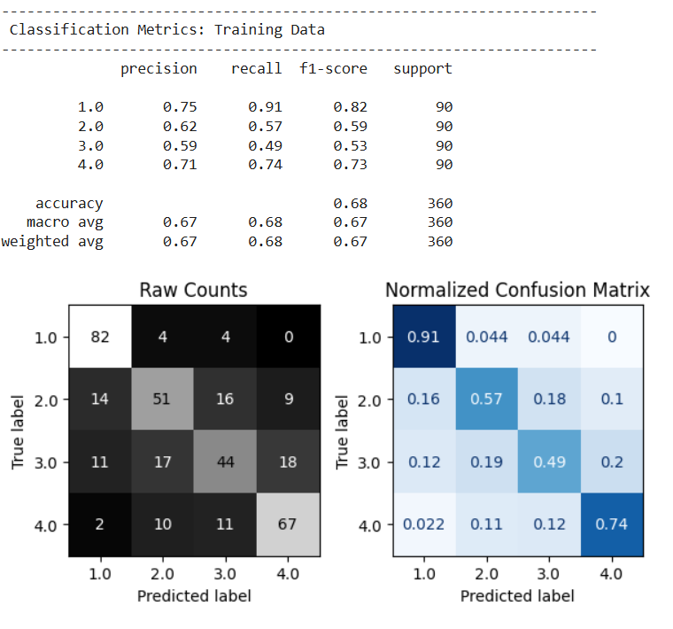
  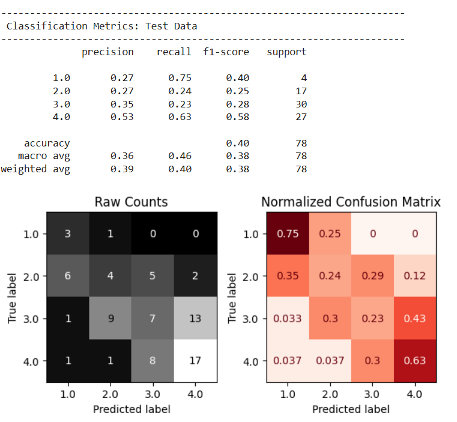

## **Tuned model**

  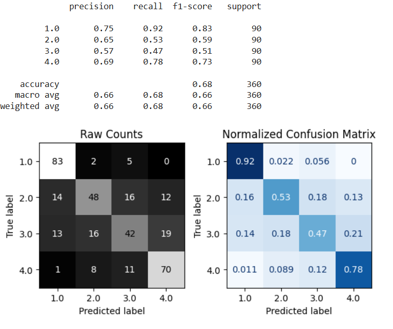
  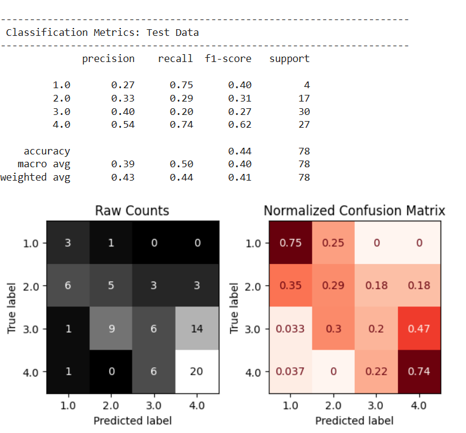

## **Feature Importaces**
* Permutation Importance

|Feature_name|permutation importance|
|----------|--------------|
|categorical__Hepatomegaly_Y|0.032051|
|numeric__Albumin|0.015385|
|numeric__Cholesterol|0.012821|
|numeric__Prothrombin|0.011538|
|categorical__Sex_F|0.011538|

------------------------------------------------------------------------------------------------------------------------------------------------------------------
## **Feature engeneering**
* PCA vs KMeans
  
  * PCA 

  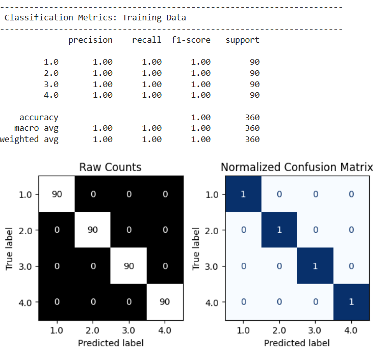
  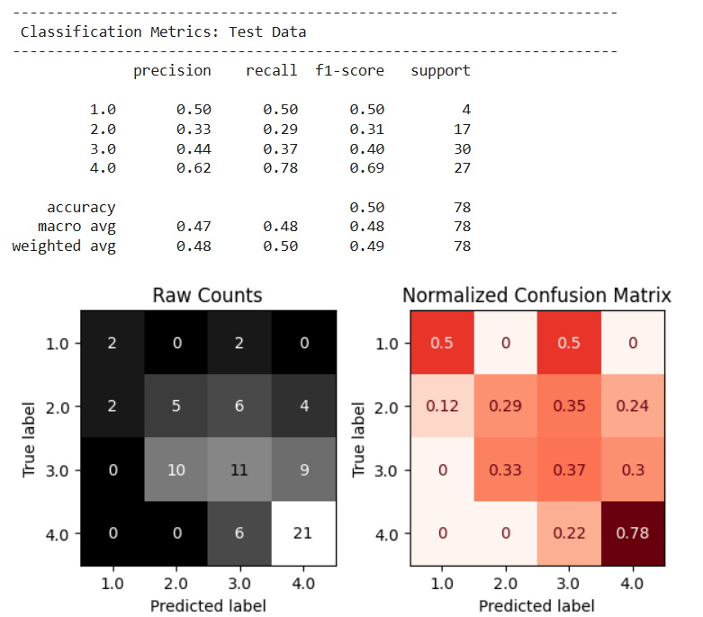

   * KMeans

  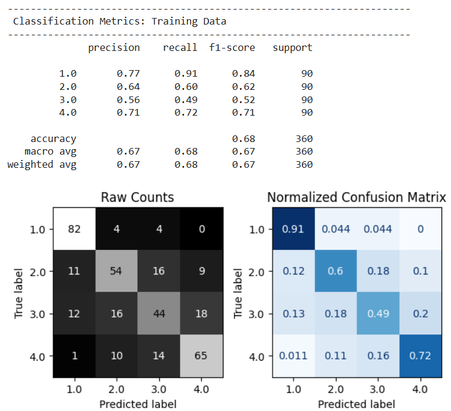
  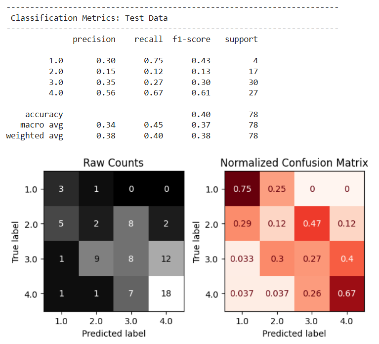

--------------------------------------------------------------------------------------------------------------

## **Feature selection**
  * Wrapper Method
  

  
  

  * Permutaion Importances after the feature selection 
  
|Feature_name|permutation importance|
|----------|--------------|
|numeric__Copper|0.0205|
|numeric__Prothrombin|0.0205|
|numeric__Cholesterol|0.0038|
|categorical__Ascites_Y|0.0026|
|categorical__Ascites_N|0.0026|

------------------------------------------------------------------------------------------------------------------------------------
## **Neural Network Model**
* 1 hidden layer ( 8 neurons ).
* 1 Dropout layer (0.3).
* 100 epochs.

  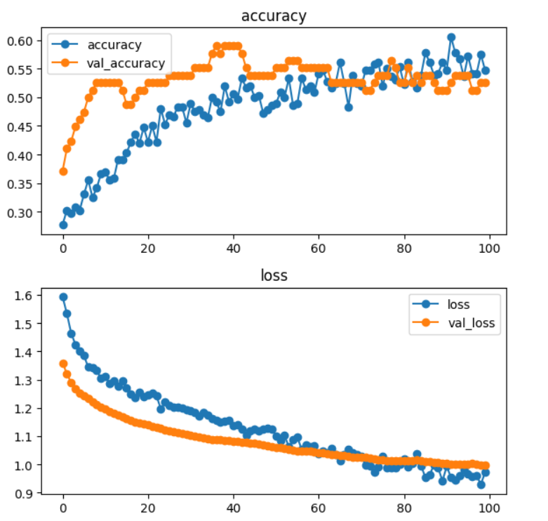
  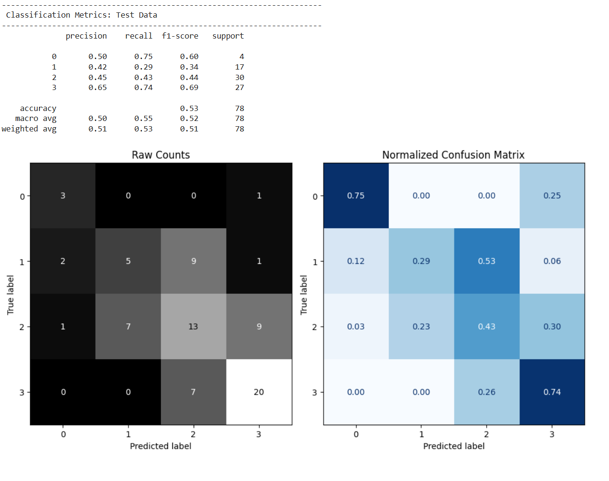

## **limitaions**
* Limited sample size.
* Potential Class Imbalanced. 
## **Results**
A Logistic Regression model was initially developed as the baseline machine learning model for this study. Several optimization techniques were explored to improve its predictive performance, including feature selection, feature importance analysis, Principal Component Analysis (PCA), K-Means clustering, feature engineering, and Synthetic Minority Oversampling Technique (SMOTE) to address class imbalance. However, none of these techniques resulted in a significant improvement in the model's performance. The evaluation metrics remained relatively stable, indicating that the model was limited by the quality of the available data rather than the choice of preprocessing or optimization methods.

The primary challenge was the high percentage of missing data in the dataset. Approximately 25% of the dataset contained missing values, with many records missing multiple features simultaneously rather than isolated values. For example, variables such as Drug, Ascites, Hepatomegaly, Spiders, Cholesterol, Copper, Alkaline Phosphatase (Alk_Phos), SGOT, and Triglycerides had over 100 missing observations each. Because the missing values were concentrated within the same samples, simple imputation techniques could have introduced substantial bias and reduced the reliability of the data. As a result, the missing data limited the effectiveness of both traditional machine learning and feature engineering techniques.

To further investigate the problem, a deep learning model was also implemented. As shown in the training curves, both the training and validation accuracy gradually increased before stabilizing at approximately 55–60%, while the training and validation loss consistently decreased and converged. Although the deep learning model learned meaningful patterns from the data without severe overfitting, its performance remained modest, suggesting that the quality and completeness of the dataset were the primary limiting factors rather than the choice of algorithm.

Overall, these findings indicate that improving data completeness and reducing the amount of missing information would likely have a greater impact on model performance than applying additional feature engineering or model optimization techniques.

